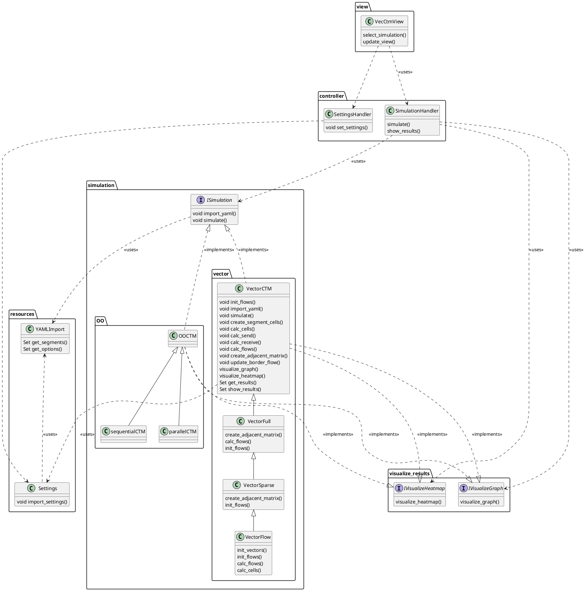

# Vectorized CTM (VecCTM) documentation


This document contains a system documentation for the vectorized CTM implementation, 
developed by Robin Hauke during his work as a student assistant at the Institute of Transport Studies at the Karlsruhe Institute of Technology,
based on the results of his Bachelor's Thesis.

The vectorized implementation was presented on the 15th International Conference on Ambient Systems, Networks and Technologies, April 23-25, 2024, Hasselt, Belgium (ANT 2024) and afterwards published in:

Hauke, R., Kübler, J., Baumann, M., & Vortisch, P. (2024).
A Vectorized Formulation of the Cell Transmission Model for Efficient Simulation of Large-Scale Freeway Networks. 
Procedia Computer Science, 238, 143-150.

VecCTM is a program for macroscopic traffic flow simulation of highway networks, based on the Cell-Transmisson Model by Daganzo.
This is implemented through several versions of the Cell-Transmission Model, written in Python 3.10. 
Both object-oriented and vectorized implementations are available, with a focus on the vectorized version,
the OO-Version being the comparison benchmark.


## Class Diagram
<details open>
<summary>Class Diagram</summary>


</details>

## Folder Structure

The source code of VecCtm includes the following directories.

| Dir       | Description                                                                                 |
|-----------|---------------------------------------------------------------------------------------------|
| benchmark | scripts for benchmarking                                                                    |
| networks  | script to generate freeway network grids with cloverleaf junctions.<br/>network model files |
| resources | log files<br/>simulation configuration<br/>other resource files                             |
| results   | simulation results                                                                          |
| traffic   | simulation scripts                                                                          |
| visualize | UI scripta to visualize simulation results                                                  |

### benchmark

The folder `benchmark` contains the script:

<details>
<summary>benchmark.py</summary>

This script executes and benchmarks the simulation scripts listed (via relative path) in the `scripts `.
The number of warm-up runs is specified by `m`, and the number of measured benchmark runs is specified by `n`.
The executions are performed using `subprocess.run(...)`. 
The total execution time of each run is stored as a dictionary entry and is exported as a JSON file at the end.
The structure of this file is as follows:

```jsmin
{
  "<relative path of script>": {
    "warmup": {
      "run counter": "execution time in seconds"
    },
    "benchmark": {
      "<run counter>": "<execution time in seconds>",
      "0": 1729.5879354476929,
      "1": 1659.9158902168274,
      "2": 1621.0911223888397
    }
  }
//next script...
}
```

</details> 

### networks
`networks`, contains sample network models of various sizes and a script for generating freeway grids.

<details>
<summary>NetGenerate.py</summary>

#### Segment Class:

- The `Segment` class represents a Segment of the road network (a road link with consistent attributes like: num of lanes).
- Attributes:
  - `SEGMENT_ID`: Unique id of the Segments.
  - `LANES`: The number of lanes in the Segment.
  - `LENGTH`: Length of the Segment in meter.
  - `predecessor`: A list of preceding Segments (merging into this Segment).
  - `successor`: A list of succeeding Segments (this Segment diverges into).
  - `velocity_free`: max speed on the Segment.
  - `is_border`: boolean value indicating whether this segment is at the border of the modeled network <br> (either no incoming or no outgoing segments).
  - `name`: name of the Segments.
  - `border_flow`: a dict to specify the in/out flow at the border.
- Methods:
  - `generate_border_flow()`: static method to generate the border flow.
  - `get_segment(segment_id)`: static methode to get the segment by id.
  - `add_predecessor(predecessor)`: adds preceding segment.
  - `add_successor(successor)`: adds succeeding Segment.
  - `set_is_border(is_border)`: set `is_border` attribute.
  - `get_yaml_representation()`: convert Segment to yaml representation.
  - `__str__()`: readable string of Segment attributes.

#### Cloverleaf class:

- The `Cloverleaf` class represents a cloverleaf junction of two freeway roads.
- Constants:
  - `CLOVERLEAF_SEGMENTS_AMOUNT`: the total amount of segments in a cloverleaf = 28.
  - `CLOVERLEAF_MAIN_TRACKS_AMOUNT`: the number of main tracks in the clover leaf = 4 (either direction of est-west, north-south).
  - `CLOVERLEAF_MAIN_SEGMENTS_INSIDE_AMOUNT`: number of Segments on a main track inside the clover leaf = 5 (one in, one out, three inside).
  - `CLOVERLEAF_MAIN_SEGMENTS_TOTAL_AMOUNT`: total number of main track Segments. Computed via `CLOVERLEAF_MAIN_TRACKS_AMOUNT * CLOVERLEAF_MAIN_SEGMENTS_INSIDE_AMOUNT`
  - `CLOVERLEAF_STRAIGHT_RAMP`:  number of ramps to switch to main track towards the right (90°) = 4.
  - `CLOVERLEAF_CIRC_RAMP`: number of ramps to switch to main track towards the left (270°) = 4.
  - `LANES_MAIN`: number of main track lanes = 3.
  - `SPEED_MAIN`: max speed (km/h) on main tracks = 130.
  - `LENGTH_INSIDE`: Segment length inside the clover leaf (meters) = 500.
  - `LENGTH_OUTSIDE`: Segment length outside the clover leaf (meters) = 2000.
  - `LANES_RAMP`: number of lanes on ramp Segments = 1.
  - `SPEED_RAMP`: max speed (km/h) on ramp Segments = 80.
- Methods:
  - `calc_length_outside()`: computes length of outside Segmentssuch that the total length of the network to be generated matches the total length of another (comparison) network. This is used for comparison of network complexity.
  - `generate_segments()`: generates all Segments of the cloverleaf.
  - `generate_inside_connections()`: generates connections between segments inside the cloverleaf.
  - `get_segment_name(stype, sid)`: get name of Segment defined by given type and ID.
  - Additional helper methods for generating segment IDs and connections.
  - `get_yaml_representation()`: Returns yaml representation of cloverleaf.
  - `__str__()`: Generates readable string representation of cloverleaf.

#### Additional Methods:

- `generate_traffic_grid(grid_size)`: generates a (square) freeway grid with the given grid size (number of main tracks per side).
- `save_yaml(data, filename)`: save network data as yaml to the given file path.
- `get_yaml_representation(data)`: gets yaml of the given network data.
- `get_options()`: returns the yaml options.

#### Main Program:

- Generates a traffic network based on the settings in `Settings`.
- Saves the generated traffic network in a YAML file.

</details>

### resources
This package contains `Settings.py`, `settings.ini`, and, after the first execution, `selected_options.json`.
Additionally, there is a file with list methods and a file for importing YAML files.

<details>
<summary>resources</summary>

<details>
<summary>ListMethods.py</summary>

This file contains two helper methods to process a list according to the requirements of the simulation.
`__fill_slots__()` takes a parameter list (list of lists) and fills it so that its size matches the number of simulation steps.
`__flatten_list__()` takes a 2D list, concatenates the two dimensions into one, and returns a 1D list.

</details>


<details>
<summary>YAMLImport.py</summary>
This class is used to import a defined network from a YAML file. 
The constructor takes a path to such a YAML file.

Then, by calling `import_file()`, the file is read, and the data is stored in the class.
We distinguish two sections: `segments` and `options`.
The segments are stored as a list of dictionaries, with each dictionary representing a segment.
The options are stored as a dictionary, and the corresponding settings are directly applied in the `Settings._Settings` class.
The segments can be retrieved using `get_segments()`.

</details>

<details>
<summary>Settings.py</summary>

The `Settings.py` file contains the settings for the simulations.
These are loaded from the `settings.ini` file.
The selected options are stored in the `Settings` class.
Die
The name of the `settings.ini` file can be changed through the constant `SETTINGS_FILE` in `Settings.py`. 

The `Settings` class is implemented as a singleton.
To access the settings, the method `Settings.get_settings()` must be called, and the returned object should be stored.

Then, the corresponding settings can be accessed via the object's attributes.
The `set_settings()` method can accept a dictionary containing new settings with the schema `Attribute:Value`.

</details>

  <details>
  <summary>settings.ini</summary>

  The `settings.ini` file contains the settings for the simulation. 
The user must ensure the plausibility of the parameters. 
The following settings need to be provided:
  
- `[vecctm_settings]`
  - `[sim_constants]`
    - `CAR_LENGTH`:  length of a vehicle in meters.
    - `FLOW_PER_LANE`: max flow per lane in vehicles per hour.
    - `WAVE_COEFFICIENT`: wave coefficient. Used for calibrating the simulation. Defaults to 18.5.
  - `[program_settings]`
    - `RESULT_PATH`: relative path to the dir, in  which results will be stored.
    - `SAVE_RESULTS`: indicates, whether results should be saved.
    - `SAVE_PLOTS`: indicates, whether plots should be saved.
    - `SHOW_PLOTS`: indicates, whether plots should be displayed.
    - `GRAPH_TYPE`:  Identifier for a representation as a graph with nodes and edges.
    - `PLOT_TYPE`: Identifier of plot type (as heatmap).
    - `SHOW_TYPE`: Flag, ob die Plots als Graphen `GRAPH_TYPE` oder Heatmaps `PLOT_TYPE` angezeigt werden sollen.
  - `[generator_settings]`
    - `STEPS`: number of simulation periods (e.g. 15 min periods with consistent inflow). Every simulation period consists of `INTERVAL` time steps.
    - `INTERVAL`: length of a simulation period in `TIME_STEP` steps.
    - `TIME_STEP`: length of a single simulation time step in seconds.
    - `LOGGING_INTERVAL`: length of logging interval for which results should saved,in `TIME_STEP`
      time steps.
    - `GRID_SIZE`: size of the road network. only relevant for `NetGenerate.py`. Network with `GRID_SIZE` x `GRID_SIZE`
      cloverleafs.
  - `[key_constants]`
    - `YAML_OPTION_PERIOD`: identifier for number of simulation periods.
    - `YAML_OPTION_INTERVAL`: identifier for simulation period length.
    - `YAML_OPTION_DURATION`: identifier for time step size.
    - `YAML_OPTION_LOGGING_INTERVAL`: identifier for logging interval.
    - `YAML_SEGMENT`: identifier for the Segments section in the YAML file.
    - `YAML_OPTION`: identifier for the Options in the YAML file.
      </details>

</details>

### traffic
This folder contains the simulation scripts, i.e. the different implementations of CTM.


<details>
<summary>SimulationInterface.py</summary>

This interface defines the methods, a CTM simulation must implement. 
The required methods are `import_yaml()` and `simulate()`.
Simulations must implement this interface so they can be controlled via GUI.

- `import_yaml_network()`: imports a road network YAML file.
- `simulate()`: runs the simulation according to Settings.
- `get_name()`: returns the unique name of the simulation method (e.g. object oriented ctm, vectorized ctm, etc.).
</details>

<details>
<summary>SimulationHandler.py</summary>

The `SimulationHandler` takes care of starting the simulation and passing the results to the UI.
It takes the simulation as a parameter and calls its methods: `import_yaml()` amd `simulate()`.
Upon termination, the results are returned.
Moreover, `SimulationType` can be found here: a mapping from simulation type to the respective implementation / simulation script.
When adding new simulation scripts, they must be registered here, so they are available in the GUI.

The `SimulationHandler`.`exec_simulation()` receives a list of `SimulationType`s and a path to a yaml configuration file.
For every simulation type, `pre_simulations()`, `simulation()` and `post_simulation()` are executed.
- `pre_simulation()`: called before the simulation, reads the yaml file and creates a simulation object.
- `simulation()`: runs the simulation.
- `post_simulation()`: called after the simulation, e.g. to clean up the simulation data/artifacts. Currently unused, hence empty.

If an error occurs in one of these methods, an error log is displayed in an error dialog.
The remaining simulations should still continue.

</details>


<details>
<summary>OO</summary>

This package contains all scripts used for the object-oriented implementation of CTM.
`cell_transmission_model.py`contains the basic data structures of the object-oriented implementation.
`networkseq.py` contains a sequential CTM implementation using that data structure.

</details>

<details>
<summary>vector</summary>

This package contains all scripts used for the vectorized implementation of CTM.
- `vector_general.py` the general structure of vectorized CTM simulation.
- `vector_full.py` provides the vectorized CTM implementation using a 2D array as adjacency matrix.
- `vector_sparse.py` provides the vectorized CTM implementation using a sparse matrix data structure as adjacency matrix.
- `vector_flow.py *`  provides the vectorized CTM implementation with a sparse matrix and advanced flow vector computation. This is the most recent version used in the published paper.


<details>
<summary>vector_general.py Attributes</summary>

- `FIRST` : key for the first element of a Segment array.
- `LAST` : key for the last element of a Segment array.
- `border_flow` : A 2D array, containing the border flow of cells (in flow of border cells). For every simulation interval (e.g. 15 min, depends on config) there is one column describing the demand/inflow at the models border cells.
- In this way, inflow can change between simulated intervals. 
- The inflow is given in veh/h for all input cells of the mode, all other values are 0.
- A simulation with n cells and m simulation intervals results in a n x m 2D array.
- `current_border_flow` : the current border flow (in flow of border cells) of the current simulation interval. 1D array of length n (n = number of cells).
- Updated by calling `update_border_flow()`, which obtains the respective column from the `border_flow` matrix.
- `cells` : 1D array that holds the current number of vehicles for each cell. Length: n
- `adjacent_matrix` : adjacency matrix of the road network encoding the connections between cells. 2D array of size n x n.
- `segment_map` : a dictionary of segment properties. Uses the Segment Id as key, and contains the following attributes:
  - `FIRST` : index of the Segment's first cell within the cell vector.
  - `PREDECESSORS` : list of indices of the last cells of all preceding Segments.
  - `SUCCESSORS` : list of indices of the first cells of all succeeding Segments.
  - `LAST` : index of the Segment's last cell within the cell vector.
- `lanes` : (constant) 1D vector with number of lanes per cell. Length: n
- `velo` : (constant) 1D vector with the maximum speed per cell. Length: n
- `flow` : 1D vector with the (out) flow per cell. Length: n
- `max_flow` : (constant) 1D vector with maximum flow per cell. Length: n
- `delta` : (constant) 1D vector with delta parameter (by Daganzo) per cell. Length: n
- `max_veh`: (constant) 1D vector with max vehicle count per cell. Length: n
- `receive` : 1D vector with receive capacity per cell: the maximum number of vehicles that can flow into a cell. Length: n
- `send` : 1D vector with send capacity per cell: the maximum number of vehicles that con flow out of a cell. Length: n
- `merge_percatage` : 1D vector with merge percentages per cell. Length: n
- `log` : a dictionary with log data. Keys are simulation steps, values are recorded vehicle counts per cell.
- `sim_step` : the current simulation step.

</details>

</details>


### visualize

This package contains the code to visualize the simulation results.

<details>
<summary>IVisualize.py</summary>

This file contains two interfaces:
- `IVisualizeGraph` with `visualize_graph()`: Shows simulations results in road graph plot. The plot shows the road network at certain simulation steps. The nodes represent the Segments, the edges represent the connections between Segments. Nodes are colored to visualize traffic flow. 
- `IVisualizeHeatmap` with `visualize_heatmap()`: Shows the simulation results as a heatmap. The heatmaps show the cells of a Segment over multiple time steps. The color represents the flow.

A simulation scripts must implement these interfaces, so the GUI can visualize its results.


</details>

<details>
<summary>VecCtm.py</summary>

The UI is currently not fully implemented. 
The following is a mixture of requirements and already implemented features.

This file contains the GUI of VecCTM. It is built with `tkinter`.
On the left, there is a list of simulations, a file selection and (in the future) a parameter configurator.
The visualization of simulation results are plotted on the right. 
The type of visualization can be selected.
The different types of simulations will be selectable via tabs.

An option to export results and visualizations is planned.
Also, an option to load and visualize previously saved simulation results is planned.

To execute a simulation via GUI, the respective script must implement the `ISimulation` interface.
Also, it must be registered in `SimulationHandler.SimulationType`.
Each simulation type has a checkbox. By clicking the `Simulieren` button, 
the list of selected simulation types and the selected file are passed to the `SimulationHandler`.
It executes one selected simulation after the other.
Finally, the results are passed to the visualization, an the plots are displayed.

For the GUI to be able to visualize a simulation type, 
the script must implement the `IVisualizeGraph` and `IVisualizeHeatmap` interfaces.

Once a visualization is generated, it should be cached while the GUI executes, 
so they dont have to be regenerated. 

- `show()` : opens the GUI. This method is async and does not block the following procedure.
- `ìnit_simulation_option_frame()` : sets up the frame, where simulation type options can be selected.
- `init_visualization_option_frame()` : sets up the frame, where visualization options can be selected.
- `init_visualization_frame()` : sets up the frame, where simulation results are plotted.
- `change_visualization()` : changes the type of visualization. Called when the user selects another visualization type.
- `choose_file()` : opens a file selector dialog, then calls `change_file()`.
- `change_file()` : sets the selected file path. If no file is selected, an error label `No file selected` is displayed. Otherwise the selected file path is displayed and the new path is saved via `save_options()`.
- `exec_simulations()`: called when the user clicks `Simulate`. Creates a list of selected simulation types. Is no file was selected an error is displayed. Otherwise, `SimulationHandler.exec_simulation()` is called with the selected list and file path. If error occur during one of the simulations, it is displayed. Finally the visualization is started.
- `visualize_simulations()` : called after the simulations were executed. Plot the visualizations for the simulation results and creates the tabs for different simulation types. 
- `load_options()` : loads the simulation options from `selected_options.json` and sets the UI-relevant fields.
- `save_options()` : saves the simulation options in `selected_options.json`.

</details>


